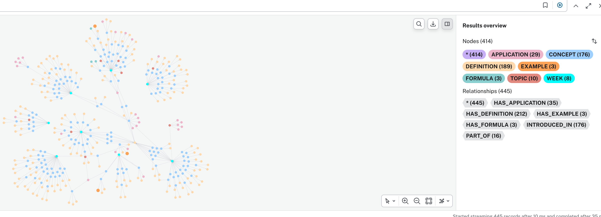

# SMARTEST O2 — Knowledge Graph Pipeline

## Overview
This repository contains the implementation of the O2 pipeline for the
"AI for Better Learning" project at the University of Westminster.
The pipeline automatically extracts knowledge graphs from academic lecture
materials using LLMs and stores them in Neo4j AuraDB for graph-based
navigation and querying.

## Tech Stack
- LlamaIndex PropertyGraphIndex — pipeline orchestration
- OpenAI gpt-4o-mini (via API) — primary LLM for extraction
- Ollama + Llama-3 8B / phi3-mini-4k — local LLM alternatives (no API cost)
- HuggingFace BAAI/bge-small-en-v1.5 — local embeddings
- Neo4j AuraDB — cloud graph database
- pdfplumber — PDF text extraction
- python-docx — DOCX text extraction
- rdflib — OWL ontology parsing for validation

## Pipeline Steps
1. Load credentials securely from .env
2. Verify Neo4j AuraDB connection
3. Test LLM connection (OpenAI API or local Ollama)
4. Define text extraction functions (PDF and DOCX)
5. Check which documents are already processed in AuraDB
6. Scan data folder and identify new lecture PDF files
7. Set up pipeline: preprocessing, schema, LLM extractor
8. Connect to existing AuraDB graph or initialise fresh index
9. Process new documents: extract, preprocess, insert, clean up, wire
10. Verify final graph state in AuraDB
11. Ontology validation against ontology_v2.owl (conformance scores)
12. Natural language query engine

## Extraction Schema
**Entity types (8):** CONCEPT, TOPIC, WEEK, APPLICATION, ASSESSMENT,
DEFINITION, EXAMPLE, FORMULA

**Relationship types (9):** INTRODUCED_IN, PART_OF, HAS_DEFINITION,
HAS_FORMULA, HAS_EXAMPLE, HAS_APPLICATION, PREREQUISITE_OF,
ASSESSED_BY, USED_IN

## Setup Instructions

### 1. Clone the repository
git clone https://github.com/Alexipsc/smartest-o2-pipeline
### 2. Create virtual environment
conda create -n smartest_o2 python=3.11
conda activate smartest_o2
pip install -r requirements.txt
### 3. Set up LLM

**Option A — OpenAI API (recommended):**
Add your OpenAI API key to the .env file (see Step 4).

**Option B — Local Ollama (no API cost):**
Download from https://ollama.com then run:
Switch the LLM in Step 7 of the notebook to the Ollama configuration.

### 4. Create .env file
Create a file called `.env` in the project root:
NEO4J_URI=your-uri-here
NEO4J_USERNAME=your-instance-id-here
NEO4J_PASSWORD=your-password-here
NEO4J_DATABASE=your-database-here
OPENAI_API_KEY=your-openai-key-here

Note: for AuraDB the username is your instance ID, not "neo4j".

### 5. Add data files
Place lecture PDF files in the `data/` folder. The pipeline automatically
processes all files containing "Lecture" in the filename. Seminar tasks,
module proforma, and schedule files are excluded automatically.

### 6. Add ontology file
Place `ontology_v2.owl` (O4 team ontology) in the project root.
Required for Step 11 ontology validation.

### 7. Run the notebook
Open `01_neo4j_connection_test.ipynb` and run all cells in order.

## Current Status
- Pipeline tested on 10 lectures (Maths for Computing, 4COSC002W)
- gpt-4o-mini run: 479 nodes, 578 relationships across 10 weeks
- Topic F1: 64% against ontology_v2.owl
- Concept anchor rate: 100%
- Ontology validation integrated (Step 11) with conformance scoring
- Natural language querying working end to end

## Known Limitations
- TOPIC name compliance is unreliable with small local models
- PREREQUISITE_OF and USED_IN extraction is sparse
- Pipeline scoped to lecture PDF files only in this phase;
  seminar DOCX files identified as future work
- Schema and TOPIC allowlist are specific to module 4COSC002W;
  must be reviewed when applying to a different module

## Next Steps
- Extend to seminar DOCX files
- Improve PREREQUISITE_OF coverage via multi-pass extraction
- Upgrade to Claude Sonnet 4.6 for stronger schema compliance
- Integrate with SMARTEST platform
- Extend O4 ontology to include concept-level definitions
  to enable concept-level validation